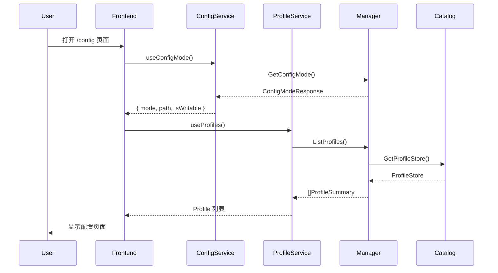
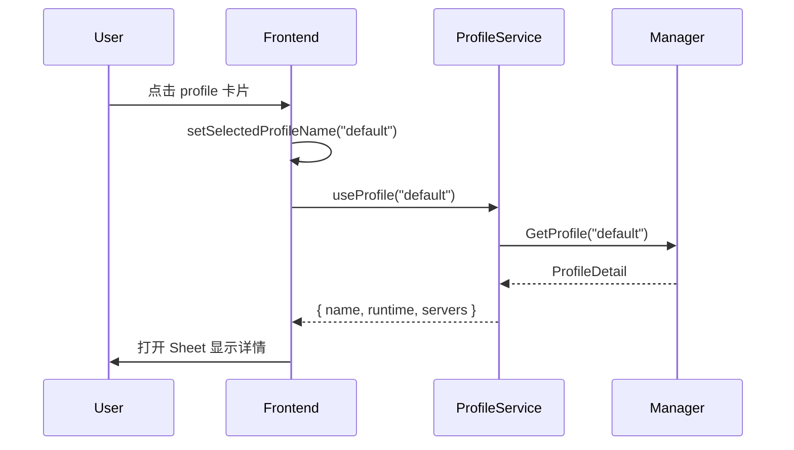
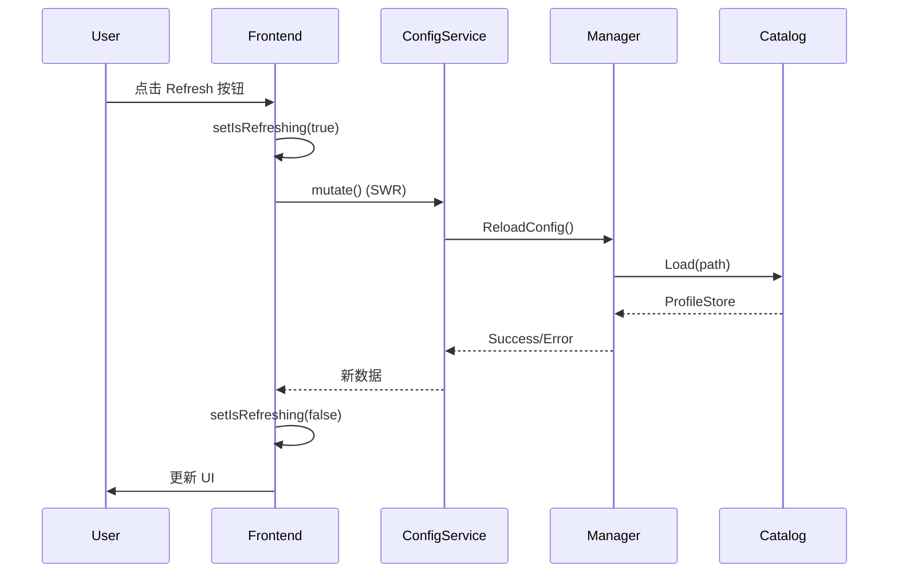
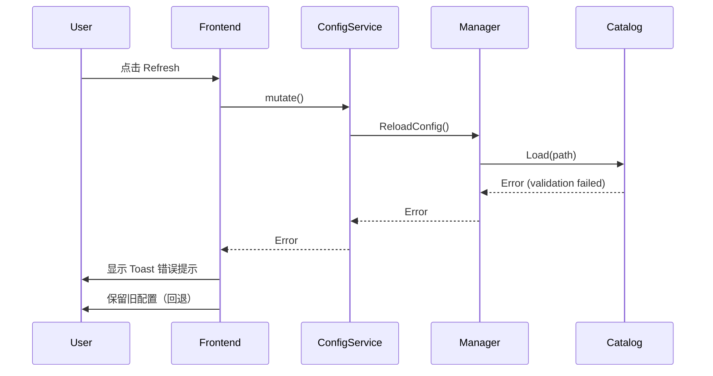

# mcpd 可视化配置系统设计文档

> **版本**: 1.0.0
> **创建时间**: 2025-12-28
> **状态**: 设计中

## 目录

1. [概述](#概述)
2. [需求分析](#需求分析)
3. [架构设计](#架构设计)
4. [UI/UX 设计](#uiux-设计)
5. [技术实现](#技术实现)
6. [交互流程](#交互流程)
7. [状态管理](#状态管理)
8. [数据流](#数据流)
9. [错误处理](#错误处理)
10. [未来扩展](#未来扩展)

---

## 概述

### 目标

为 mcpd Wails 应用提供直观、易用的可视化配置管理界面，让**普通用户**能够在不理解 MCP 协议细节的情况下，轻松查看和理解配置。

### 用户画像

- **主要用户**: 前端/全栈开发者，需要快速组合多个 MCP server
- **使用场景**: 本地开发环境，快速查看已配置的 servers 和 profiles
- **技术水平**: 熟悉基本的 YAML 配置文件，但不想手动编辑复杂配置

### 核心原则

1. **轻量编辑**: P0 支持 profiles/callers/servers 的基础编辑，改动落盘后需手动重启 Core 生效
2. **信息清晰**: 用极简的设计语言展示配置信息，避免信息过载
3. **遵循现有设计**: 完全遵循 `components/ui` 的设计语言和组件规范
4. **快速定位**: 提供配置文件路径显示和"在编辑器中打开"功能

---

## 需求分析

### P0 功能范围（首个版本）

#### 1. Profile 管理
- ✅ 查看所有 profiles 列表
- ✅ 切换和选择 profile
- ✅ 查看 profile 详情（servers 列表、runtime config）
- ✅ 识别 default profile（带 star 图标）
- ✅ 显示每个 profile 的 server 数量
- ✅ 新建 profile（仅目录结构 profile store）
- ✅ 删除 profile（默认 profile 保护，caller 引用校验）

#### 2. Server 配置展示
- ✅ 以卡片形式展示 servers
- ✅ 显示基础信息：name, cmd, 运行状态
- ✅ 开关 server（disabled 字段）
- ✅ 删除 server
- ✅ 从 MCP 客户端 JSON 导入 servers（写入 profiles，需重启 Core 生效）
- ✅ 可展开查看详细配置：
  - Command 和参数
  - 工作目录 (cwd)
  - 环境变量（脱敏处理）
  - Idle timeout, max concurrent, min ready
  - Strategy / Session TTL 标签
  - 暴露的 tools 列表
- ⚠️ 运行时状态集成（依赖后端实现）:
  - 实例数量（starting/ready/busy/stopped）
  - 配置标签（strategy/session TTL）

#### 3. Caller 映射管理
- ✅ 查看 caller → profile 映射关系
- ✅ 在 profile 详情页显示使用该 profile 的 callers
- ✅ 表格式展示所有 callers
- ✅ 新增/修改/删除 caller → profile 映射（仅目录结构 profile store）

#### 4. 配置文件管理
- ✅ 显示当前加载的配置文件路径
- ✅ 显示配置模式（单文件 / 目录结构）
- ✅ 显示是否可写（writable badge）
- ✅ 手动重新加载按钮
- ⚠️ "在编辑器中打开"按钮（需实现系统调用）
- ✅ 所有写操作提示“需要重启 Core 生效”

### P1 功能（后续版本）

- Runtime Config 的可视化编辑
- Server 配置的表单式编辑
- 配置验证和实时错误提示
- 配置模板下载
- 导出当前配置为 YAML
- 热更新/热重载（无需重启 Core）

### 非目标（初期）

- ❌ 在线创建新 server 配置
- ❌ 实时监听配置文件变化
- ❌ 配置版本管理

---

## 架构设计

### 整体架构

```
┌─────────────────────────────────────────────────────────┐
│                    Frontend (React)                      │
│  ┌────────────────────────────────────────────────────┐ │
│  │  ConfigPage (路由: /config)                        │ │
│  │  ├─ ConfigHeader (标题 + 重新加载按钮)            │ │
│  │  ├─ Tabs                                           │ │
│  │  │  ├─ Profiles Tab                               │ │
│  │  │  │  ├─ ProfilesList (卡片列表)                │ │
│  │  │  │  └─ ProfileDetailSheet (抽屉详情)          │ │
│  │  │  └─ Callers Tab                                │ │
│  │  │     └─ CallersList (表格)                      │ │
│  │  └─ ConfigEmpty (空状态提示)                      │ │
│  └────────────────────────────────────────────────────┘ │
│                         ↕ Hooks (SWR)                    │
│  ┌────────────────────────────────────────────────────┐ │
│  │  useConfigMode(), useProfiles(),                   │ │
│  │  useProfile(name), useCallers()                    │ │
│  └────────────────────────────────────────────────────┘ │
│                         ↕ Wails Bindings                 │
└─────────────────────────────────────────────────────────┘
                             ↕
┌─────────────────────────────────────────────────────────┐
│                   Backend (Go)                           │
│  ┌────────────────────────────────────────────────────┐ │
│  │  ConfigService / ProfileService                  │ │
│  │  (internal/ui/*_service.go)                      │ │
│  │  ├─ ConfigService.GetConfigMode() → ConfigModeResponse │ │
│  │  ├─ ProfileService.ListProfiles() → []ProfileSummary    │ │
│  │  ├─ ProfileService.GetProfile(name) → ProfileDetail     │ │
│  │  └─ ProfileService.GetCallers() → map[string]string     │ │
│  └────────────────────────────────────────────────────┘ │
│                         ↕                                │
│  ┌────────────────────────────────────────────────────┐ │
│  │  Manager (internal/ui/manager.go)                  │ │
│  │  ├─ LoadConfig(path)                               │ │
│  │  └─ GetProfileStore() → ProfileStore              │ │
│  └────────────────────────────────────────────────────┘ │
│                         ↕                                │
│  ┌────────────────────────────────────────────────────┐ │
│  │  ProfileStoreLoader (internal/infra/catalog)       │ │
│  │  └─ Load(path) → domain.ProfileStore              │ │
│  └────────────────────────────────────────────────────┘ │
└─────────────────────────────────────────────────────────┘
```

### 目录结构

```
frontend/src/modules/config/
├── config-page.tsx           # 主页面组件 (master-detail layout)
├── hooks.ts                  # SWR 数据获取 hooks
├── atoms.ts                  # Jotai 状态原子
└── components/
    ├── profiles-list.tsx     # Profile 列表 (左侧面板)
    ├── profile-detail-panel.tsx  # Profile 详情面板 (右侧内联)
    └── callers-list.tsx      # Caller 列表 (divide-y pattern)
```

---

## UI/UX 设计

### 设计语言

**极简视觉层次，避免 Card 阴影和边框堆叠**：

- **无 Card 阴影**: 避免使用 Card 组件的多层阴影，改用 `bg-muted/30`、`hover:bg-muted/50`
- **最小边框**: 使用 `divide-y divide-border/50` 分隔元素，而非包裹边框
- **扁平层次**: Master-detail 布局，左右分栏而非 Sheet 覆盖
- **微交互**: 使用 Motion `m.` 前缀，配合简洁的淡入/滑入动画

### 页面布局

#### 1. ConfigPage 主页面 - Master-Detail 布局

```
┌─────────────────────────────────────────────────────────────┐
│  [FileSliders] Configuration            [Refresh]          │
│  [Mode Icon] /path/to/config  [Writable Badge]             │
├─────────────────────────────────────────────────────────────┤
│  Profiles (3)  |  Callers (2)       ← Tabs                  │
├───────────────────┬─────────────────────────────────────────┤
│  Left Panel       │  Right Panel (Detail)                   │
│  (w-64, fixed)    │  (flex-1)                               │
│                   │                                         │
│  ○ default ★      │  default                   [2 servers]  │
│    2 servers      │  ├─ Runtime Configuration    ▾         │
│                   │  │  Route Timeout: 10s                  │
│  ○ vscode         │  │  Ping Interval: 30s                  │
│    3 servers      │  │  ...                                 │
│                   │  │                                      │
│  ○ cursor         │  ├─ Servers                             │
│    1 server       │  │  ├─ weather [Persistent]   ▾        │
│                   │  │  │  Command: node ...                │
│                   │  │  │  Idle: 60s  Max: 1                │
│                   │  │  │                                   │
│                   │  │  └─ another-server         ▸        │
└───────────────────┴─────────────────────────────────────────┘
```

#### 2. Profiles Tab - 左右分栏

- **左侧面板** (w-64): ProfilesList 组件，简单按钮列表，选中状态用 `bg-accent`
- **右侧面板** (flex-1): ProfileDetailPanel 组件，内联显示（非 Sheet 覆盖）
- 点击 profile 时切换选中状态，右侧面板同步更新

#### 3. Callers Tab - 简洁列表

使用 `divide-y divide-border/50` 分隔，无 Card 包裹：

```
caller-name → profile-name
another     → default
```

### 颜色与状态标识

#### Badge 变体

- **Default Profile**: `variant="secondary"` + Star icon (fill)
- **Writable**: `variant="outline" text-success border-success/30`
- **Directory/File Mode**: `variant="secondary"`
- **Persistent Server**: `variant="secondary"`
- **Sticky Server**: `variant="outline"`
- **Expose Tools (Yes)**: `variant="success"`
- **Expose Tools (No)**: `variant="secondary"`

#### 运行状态（P1）

- **Starting**: `text-warning` + Spinner
- **Ready**: `text-success` + Dot
- **Busy**: `text-primary` + Activity icon
- **Stopped**: `text-muted` + Circle
- **Failed**: `text-destructive` + Alert icon

### 动画规范

**统一使用 Motion 的 `m.` 前缀**（不使用 `motion.`）：

```tsx
import { m } from 'motion/react'
import { Spring } from '@/lib/spring'

// 列表项进入动画
<m.div
  initial={{ opacity: 0, y: 10 }}
  animate={{ opacity: 1, y: 0 }}
  transition={Spring.smooth(0.3, index * 0.05)}
>
  {children}
</m.div>

// 页面切换动画
<m.div
  initial={{ opacity: 0 }}
  animate={{ opacity: 1 }}
  transition={Spring.smooth(0.3)}
>
  {content}
</m.div>
```

### 响应式布局

- **最小宽度**: 640px（sm breakpoint）
- **Runtime Config Grid**: `grid-cols-2`，小屏幕下 `grid-cols-1`
- **Server Settings Grid**: `grid-cols-3`，小屏幕下 `grid-cols-2` 或 `grid-cols-1`

---

## 技术实现

### 前端技术栈

- **框架**: React 19 + TypeScript
- **路由**: TanStack Router（文件式路由）
- **状态管理**: Jotai（原子化状态）
- **数据获取**: SWR（缓存 + 自动重验证）
- **样式**: Tailwind CSS v4
- **动画**: Motion（使用 `m.` 前缀）
- **UI 组件**: 自定义 `components/ui` 库

### 后端技术栈（Go）

- **服务层**: `internal/ui/*_service.go` (ConfigService / ProfileService / RuntimeService)
- **管理层**: `internal/ui/manager.go` (Manager)
- **数据层**: `internal/infra/catalog` (ProfileStoreLoader)
- **绑定生成**: Wails v3 自动生成 TypeScript bindings

### 关键 Hooks

#### 1. useConfigMode

```ts
export function useConfigMode() {
  const setConfigMode = useSetAtom(configModeAtom)

  const { data, error, isLoading, mutate } = useSWR<ConfigModeResponse>(
    'config-mode',
    () => ConfigService.GetConfigMode(),
  )

  useEffect(() => {
    if (data) setConfigMode(data)
  }, [data, setConfigMode])

  return { data, error, isLoading, mutate }
}
```

**返回数据**:
```ts
{
  mode: "directory" | "single",
  path: "/path/to/config",
  isWritable: boolean
}
```

#### 2. useProfiles

```ts
export function useProfiles() {
  const setProfiles = useSetAtom(profilesAtom)

  const { data, error, isLoading, mutate } = useSWR<ProfileSummary[]>(
    'profiles',
    () => ProfileService.ListProfiles(),
  )

  useEffect(() => {
    if (data) setProfiles(data)
  }, [data, setProfiles])

  return { data, error, isLoading, mutate }
}
```

**返回数据**:
```ts
[
  {
    name: "default",
    serverCount: 2,
    isDefault: true
  },
  {
    name: "vscode",
    serverCount: 3,
    isDefault: false
  }
]
```

#### 3. useProfile

```ts
export function useProfile(name: string | null) {
  const setSelectedProfile = useSetAtom(selectedProfileAtom)

  const { data, error, isLoading, mutate } = useSWR<ProfileDetail | null>(
    name ? ['profile', name] : null,
    () => (name ? ProfileService.GetProfile(name) : null),
  )

  useEffect(() => {
    if (data !== undefined) setSelectedProfile(data)
  }, [data, setSelectedProfile])

  return { data, error, isLoading, mutate }
}
```

**返回数据**:
```ts
{
  name: "default",
  runtime: {
    routeTimeoutSeconds: 10,
    pingIntervalSeconds: 30,
    toolRefreshSeconds: 60,
    callerCheckSeconds: 5,
    callerInactiveSeconds: 300,
    exposeTools: true,
    toolNamespaceStrategy: "prefix",
    observability: { listenAddress: "0.0.0.0:9090" },
    rpc: {
      listenAddress: "unix:///tmp/mcpd.sock",
      maxRecvMsgSize: 16777216,
      // ...
    }
  },
  servers: [
    {
      name: "weather",
      cmd: ["/bin/sh", "-c", "node ./weather-demo-mcp/build/index.js"],
      env: {},
      cwd: "",
      idleSeconds: 60,
      maxConcurrent: 1,
      strategy: "stateless",
      sessionTTLSeconds: 0,
      minReady: 0,
      drainTimeoutSeconds: 5,
      protocolVersion: "2025-11-25",
      exposeTools: []
    }
  ]
}
```

#### 4. useCallers

```ts
export function useCallers() {
  const setCallers = useSetAtom(callersAtom)

  const { data, error, isLoading, mutate } = useSWR<Record<string, string>>(
    'callers',
    () => ProfileService.GetCallers(),
  )

  useEffect(() => {
    if (data) setCallers(data)
  }, [data, setCallers])

  return { data, error, isLoading, mutate }
}
```

**返回数据**:
```ts
{
  "vscode": "default",
  "cursor": "vscode"
}
```

### 状态原子（Jotai）

```ts
// atoms.ts
import { atom } from 'jotai'

export const configModeAtom = atom<ConfigModeResponse | null>(null)
export const profilesAtom = atom<ProfileSummary[]>([])
export const selectedProfileAtom = atom<ProfileDetail | null>(null)
export const selectedProfileNameAtom = atom<string | null>(null)
export const callersAtom = atom<Record<string, string>>({})
```

### Wails Go 服务接口

```go
// internal/ui/service.go

// GetConfigMode 返回配置模式和路径
func (s *ConfigService) GetConfigMode() ConfigModeResponse {
    store := s.manager.GetProfileStore()
    return ConfigModeResponse{
        Mode:       detectMode(store),  // "directory" or "single"
        Path:       s.manager.GetConfigPath(),
        IsWritable: s.manager.IsWritable(),
    }
}

// ListProfiles 返回所有 profiles 的摘要信息
func (s *ProfileService) ListProfiles() []ProfileSummary {
    store := s.manager.GetProfileStore()
    var summaries []ProfileSummary
    for name, profile := range store.Profiles {
        summaries = append(summaries, ProfileSummary{
            Name:        name,
            ServerCount: len(profile.Catalog.Specs),
            IsDefault:   name == domain.DefaultProfileName,
        })
    }
    return summaries
}

// GetProfile 返回指定 profile 的详细信息
func (s *ProfileService) GetProfile(name string) *ProfileDetail {
    store := s.manager.GetProfileStore()
    profile, ok := store.Profiles[name]
    if !ok {
        return nil
    }

    // Convert domain types to frontend types
    return &ProfileDetail{
        Name:    name,
        Runtime: convertRuntimeConfig(profile.Catalog.Runtime),
        Servers: convertServerSpecs(profile.Catalog.Specs),
    }
}

// GetCallers 返回 caller → profile 映射
func (s *ProfileService) GetCallers() map[string]string {
    store := s.manager.GetProfileStore()
    return store.Callers
}
```

---

## 交互流程

### 1. 应用启动流程



### 2. 查看 Profile 详情流程



### 3. 重新加载配置流程



### 4. 配置验证失败流程



---

## 数据流

### 配置加载流程

```
配置目录 (runtime.yaml + callers.yaml + profiles/*.yaml)
    ↓ (读取)
ProfileStoreLoader.Load()
    ↓ (解析 + 验证)
domain.ProfileStore
    ↓ (存储)
Manager.profileStore
    ↓ (转换)
[]ProfileSummary, ProfileDetail
    ↓ (Wails Bindings)
Frontend (SWR Cache)
    ↓ (Jotai Atoms)
React Components
```

### 数据转换层

**Go Domain → Frontend Types**:

```go
// domain.RuntimeConfig → RuntimeConfigDetail
func convertRuntimeConfig(cfg domain.RuntimeConfig) RuntimeConfigDetail {
    return RuntimeConfigDetail{
        RouteTimeoutSeconds:   cfg.RouteTimeoutSeconds,
        PingIntervalSeconds:   cfg.PingIntervalSeconds,
        // ... 映射其他字段
    }
}

// domain.ServerSpec → ServerSpecDetail
func convertServerSpec(spec domain.ServerSpec) ServerSpecDetail {
    return ServerSpecDetail{
        Name:          spec.Name,
        Cmd:           spec.Cmd,
        Env:           spec.Env,
        // ... 映射其他字段
    }
}
```

---

## 错误处理

### 错误类型

#### 1. 配置文件不存在

**场景**: 首次启动，未找到配置文件

**UI 表现**:
```tsx
<ConfigEmpty>
  <EmptyTitle>No configuration loaded</EmptyTitle>
  <EmptyDescription>
    Start the server with a configuration file to see your profiles here.
  </EmptyDescription>
</ConfigEmpty>
```

#### 2. 配置验证失败

**场景**: 配置文件格式错误或字段验证失败

**UI 表现**:
```tsx
// Toast 错误提示
toast.error("Failed to load configuration", {
  description: errorMessage,
  action: {
    label: "View Logs",
    onClick: () => navigate('/logs')
  }
})
```

**后端处理**:
```go
// Manager.ReloadConfig()
if err := s.loadConfig(ctx, path); err != nil {
    s.logger.Error("failed to reload config", zap.Error(err))
    // 保留旧配置，不覆盖 profileStore
    return err
}
```

#### 3. Profile 不存在

**场景**: 用户请求不存在的 profile

**UI 表现**:
```tsx
if (!profile) {
  return (
    <Card>
      <CardContent className="flex items-center justify-center h-64">
        Profile not found
      </CardContent>
    </Card>
  )
}
```

#### 4. Wails 调用失败

**场景**: 前端调用后端方法时网络或运行时错误

**UI 表现**:
```tsx
// SWR error handling
const { data, error } = useProfiles()

if (error) {
  return (
    <Alert variant="destructive">
      <AlertTitle>Error</AlertTitle>
      <AlertDescription>
        Failed to load profiles: {error.message}
      </AlertDescription>
    </Alert>
  )
}
```

### 错误恢复策略

| 错误类型 | 恢复策略 | 用户操作 |
|---------|---------|---------|
| 配置文件不存在 | 显示空状态提示 | 创建配置文件后重启应用 |
| 验证失败 | 保留旧配置 | 修复配置文件后点击 Refresh |
| Profile 不存在 | 显示错误卡片 | 返回列表重新选择 |
| Wails 调用失败 | SWR 自动重试 | 点击 Refresh 手动重试 |

---

## 未来扩展

### P1: 配置编辑能力

#### 1. Server 配置表单

```tsx
<ServerEditDialog>
  <Form>
    <FormField name="name" label="Server Name" />
    <FormField name="cmd" label="Command" type="array" />
    <FormField name="env" label="Environment Variables" type="keyValue" />
    <FormField name="idleSeconds" label="Idle Timeout (seconds)" type="number" />
    <FormField name="maxConcurrent" label="Max Concurrent" type="number" />
    <FormField name="strategy" label="Strategy" type="select" />
    <FormField name="sessionTTLSeconds" label="Session TTL (seconds)" type="number" />
  </Form>
</ServerEditDialog>
```

#### 2. 配置持久化

**写入流程**:
```
User Edit → Frontend Validation → ProfileService.SaveProfile()
  → Manager.SaveProfile() → YAML Write → Reload Config
```

**Wails 方法**:
```go
func (s *ProfileService) SaveProfile(name string, detail ProfileDetail) error {
    // 1. 转换 frontend types → domain types
    // 2. 写入 YAML 文件
    // 3. 重新加载配置
    // 4. 发送 reload 事件到前端
}
```

### P2: 高级功能

#### 1. 配置模板系统

```tsx
<TemplateGallery>
  <TemplateCard name="Basic MCP Server">
    <TemplatePreview />
    <Button onClick={applyTemplate}>Apply Template</Button>
  </TemplateCard>
</TemplateGallery>
```

#### 2. 配置版本管理

```tsx
<ConfigHistory>
  <HistoryItem timestamp="2025-12-28 10:00" author="system">
    Added weather server
  </HistoryItem>
  <HistoryItem timestamp="2025-12-27 14:30" author="user">
    Updated idle timeout
  </HistoryItem>
</ConfigHistory>
```

#### 3. 配置导出 / 导入

```tsx
<ConfigActions>
  <Button onClick={exportConfig}>Export as YAML</Button>
  <Button onClick={importConfig}>Import from File</Button>
  <Button onClick={downloadTemplate}>Download Template</Button>
</ConfigActions>
```

### P3: 运行时集成

#### 1. 实时状态监控

```tsx
<ServerCard>
  <ServerHeader>
    weather
    <StatusBadge status="ready">Ready</StatusBadge>
  </ServerHeader>
  <ServerMetrics>
    <Metric label="Instances">2 / 4</Metric>
    <Metric label="Requests">1.2k</Metric>
    <Metric label="Errors">0.1%</Metric>
  </ServerMetrics>
</ServerCard>
```

#### 2. 日志关联

```tsx
<ServerCard>
  <Button onClick={() => navigate('/logs', { filter: { server: 'weather' } })}>
    View Logs
  </Button>
</ServerCard>
```

#### 3. 实例管理

```tsx
<InstanceList>
  <InstanceCard id="weather-1" status="ready" />
  <InstanceCard id="weather-2" status="busy" />
  <Button onClick={scaleUp}>+ Add Instance</Button>
</InstanceList>
```

---

## 附录

### A. 完整组件树

```
ConfigPage
├── ConfigHeader
│   ├── Title + Mode/Path info
│   └── RefreshButton
├── Separator
└── ConfigTabs | ConfigEmpty
    ├── TabsList
    │   ├── Profiles Tab (with count badge)
    │   └── Callers Tab (with count badge)
    ├── TabsContent (Profiles) ← Master-Detail Layout
    │   ├── Left Panel (w-64)
    │   │   └── ProfilesList
    │   │       └── m.button (profile item)
    │   │           ├── Star/Layers icon
    │   │           ├── Profile name
    │   │           └── Server count
    │   └── Right Panel (flex-1)
    │       └── ProfileDetailPanel
    │           ├── Header (name + badge)
    │           ├── Accordion (Runtime)
    │           │   └── DetailRow items
    │           └── Accordion (Servers)
    │               └── ServerItem (per server)
    │                   ├── Command block
    │                   ├── Env vars
    │                   └── Settings grid
    └── TabsContent (Callers)
        └── CallersList
            └── m.div (divide-y)
                └── caller → profile rows
```

### B. 类型定义速查

```ts
// ConfigModeResponse
{
  mode: "directory" | "single"
  path: string
  isWritable: boolean
}

// ProfileSummary
{
  name: string
  serverCount: number
  isDefault: boolean
}

// ProfileDetail
{
  name: string
  runtime: RuntimeConfigDetail
  servers: ServerSpecDetail[]
}

// RuntimeConfigDetail
{
  routeTimeoutSeconds: number
  pingIntervalSeconds: number
  toolRefreshSeconds: number
  callerCheckSeconds: number
  exposeTools: boolean
  toolNamespaceStrategy: string
  observability: { listenAddress: string }
  rpc: RPCConfigDetail
}

// ServerSpecDetail
{
  name: string
  cmd: string[]
  env: Record<string, string>
  cwd: string
  idleSeconds: number
  maxConcurrent: number
  strategy: string
  sessionTTLSeconds: number
  minReady: number
  drainTimeoutSeconds: number
  protocolVersion: string
  exposeTools: string[]
}

// Callers
Record<string, string>  // caller → profile
```

### C. 关键 Go 方法签名

```go
// ConfigService/ProfileService methods
func (s *ConfigService) GetConfigMode() ConfigModeResponse
func (s *ProfileService) ListProfiles() []ProfileSummary
func (s *ProfileService) GetProfile(name string) *ProfileDetail
func (s *ProfileService) GetCallers() map[string]string

// Manager methods (internal)
func (m *Manager) LoadConfig(ctx context.Context, path string) error
func (m *Manager) ReloadConfig(ctx context.Context) error
func (m *Manager) GetProfileStore() domain.ProfileStore
func (m *Manager) GetConfigPath() string
func (m *Manager) IsWritable() bool
```

### D. 环境变量脱敏规则

**显示策略**:
- 以 `${` 开头的环境变量引用：**显示原文**（如 `${API_KEY}`）
- 实际值：**显示为 `••••••`**

```tsx
{Object.entries(server.env).map(([key, value]) => (
  <div key={key}>
    <Badge>{key}</Badge>
    <span>{value.startsWith('${') ? value : '••••••'}</span>
  </div>
))}
```

---

**文档结束**

**下一步行动**:
1. ✅ 完成基础架构（已实现）
2. ⚠️ 实现"在编辑器中打开"功能（需调用系统 API）
3. ⚠️ 集成运行时状态展示（需后端支持）
4. 🔜 P1: 添加配置编辑能力
5. 🔜 P2: 配置模板和导入/导出
6. 🔜 P3: 运行时监控集成
